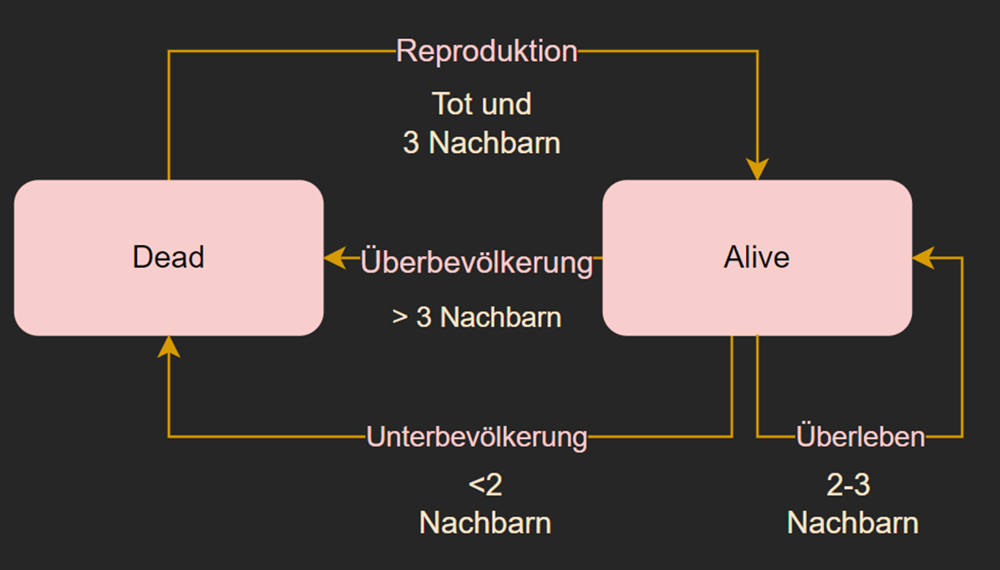
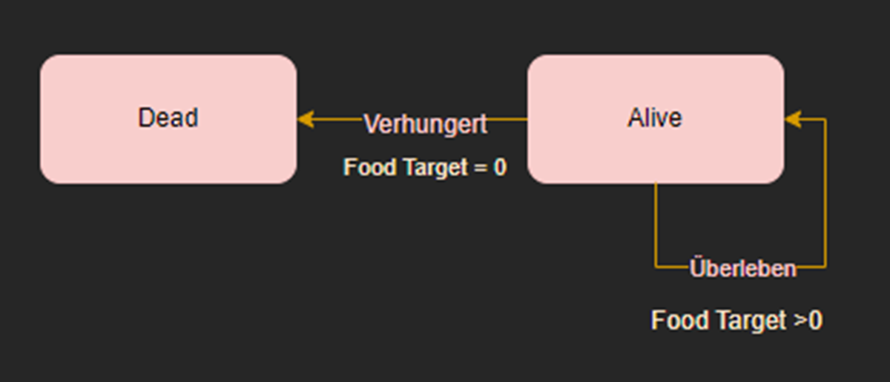

# Y_Life

### Hintergrund:
Das Projekt zielt darauf ab, das klassische Conway's Game of Life etwas abzuwandeln um neue Kentnisse in der Programmiersprache Java, Swing/AWT und DesignPatterns zu erhalten.
### Beschreibung:
Im gegensatz zum Game of life wird nur ein Teil des Spiels simuliert. Zum Spielstart wird eine beliebige Anzahl Schafe generiert.
Die Schafe folgen der Game of Life Logik und können gefressen werden, was einen Einfluss auf ihre nächste Zustände hat.
Der Wolf ist der interaktive Teil des Spiels. Er wird durch den Spieler beeinflusst in dem er den Wolf via Tastatur steuert. Ziel ist es alle Schafe auszulöschen in dem sie gefressen oder in deren Zyklus so beeinflusst werden, dass sie sich nicht reproduzieren.
Alle Schafe ändern in jedem Schritt (via Timer, pro Sekunde) ihren Zustand gemäss dem Game of Life.
Der Wolf verliert bei jeder Tastatureingabe Energie. Die Startenergie ist 5 und bei jedem gefressenen Schaf wird die energie um 5 erhöht.
Hat der Wolf keine Energie mehr, so ist das Spiel verlohren.

### Die States des Game of Life
In diesem Projekt ist dies die momentane Logik welche die Schafe befolgen

### Weitere States
Der Wolf wird vom Spieler bewegt und (wird) die folgenden States enthalten

