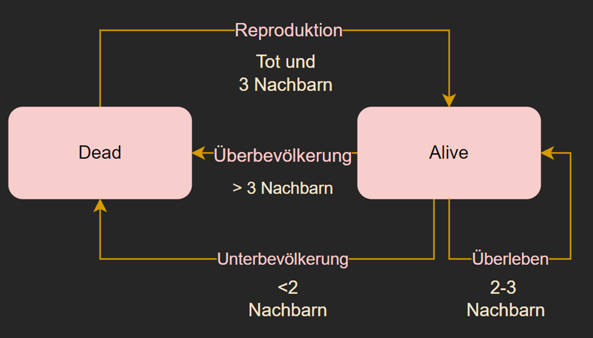
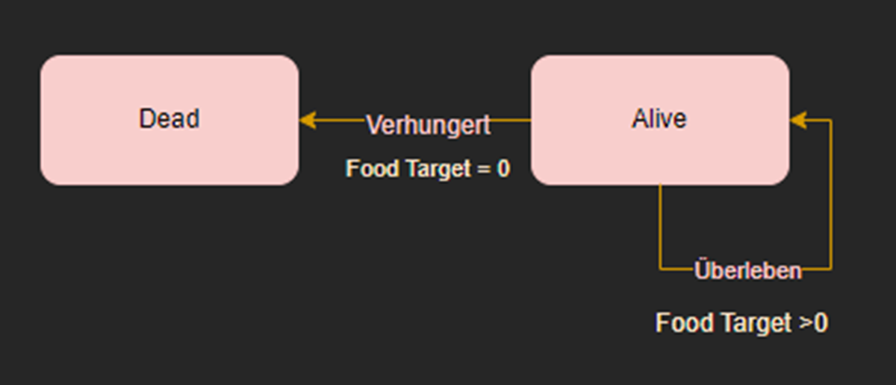
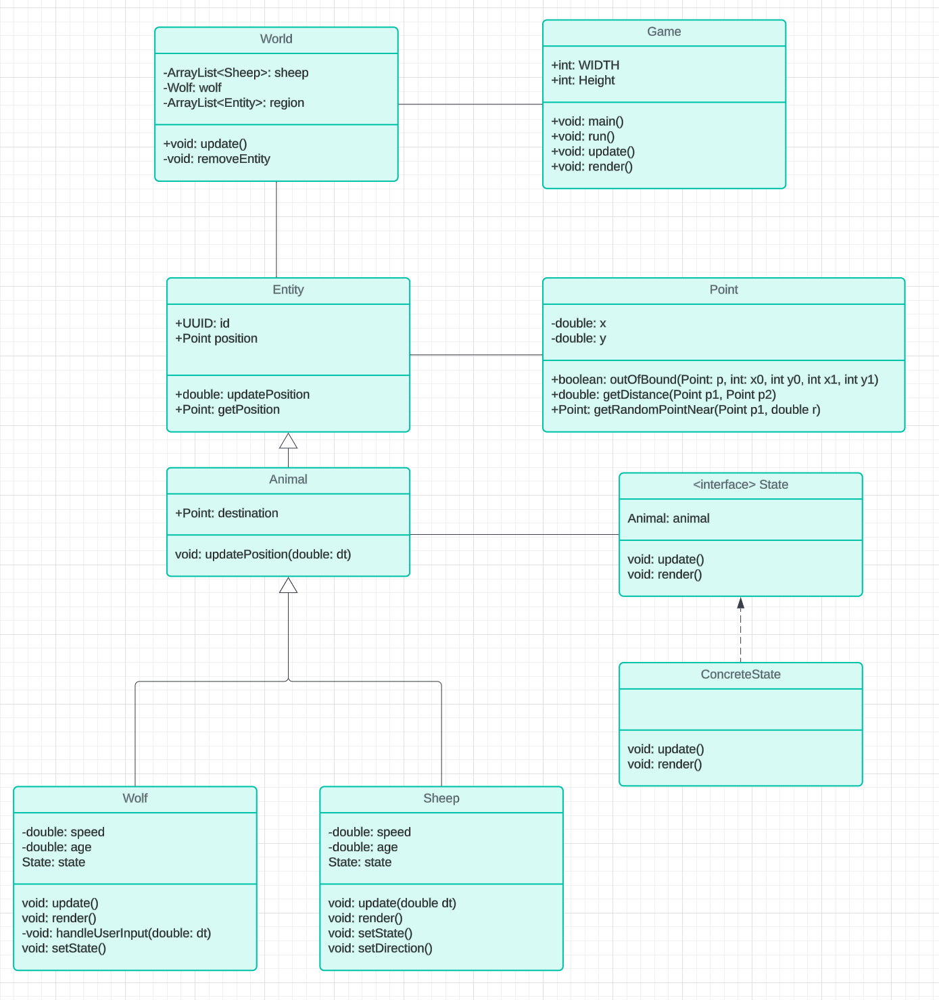

# Y_Life

### Hintergrund:
Das Projekt zielt darauf ab, das klassische Conway's Game of Life etwas abzuwandeln um neue Kentnisse in der Programmiersprache Java, Swing/AWT und DesignPatterns zu erhalten.
### Beschreibung:
Im gegensatz zum Game of life wird nur ein Teil des Spiels simuliert. Zum Spielstart wird eine beliebige Anzahl Schafe in unterschiedlichen States generiert.
Die Schafe haben Bedürfnisse die sie erfüllen müssen aber gleichzeitig müssen sie vom Wolf fliehen.
Der Wolf ist der interaktive Teil des Spiels. Er wird durch den Spieler beeinflusst in dem er den Wolf spielt, welcher die Schafe jagen soll.
Die grundlegenden Regeln des Game of Life sind:
Startzustand festlegen: Festlegen einer beliebigen Anzahl aus lebenden Schaffen.
Evolution: Anwendung einfacher Regeln auf alle Schafe und den Wolf, um ihren Zustand in jedem Schritt zu aktualisieren.
Simulationsschritt ausführen: Durchführung der Evolution für alle Tiere gleichzeitig.
Interaktion: Möglichkeit für den Benutzer,den Wolf zu steuern.

### Die States des Game of Life
In diesem Projekt ist dies die momentane Logik welche die Schafe befolgen

### Weitere States
Der Wolf wird vom Spieler bewegt und (wird) die folgenden States enthalten

### (Draft) Klassendiagramm

